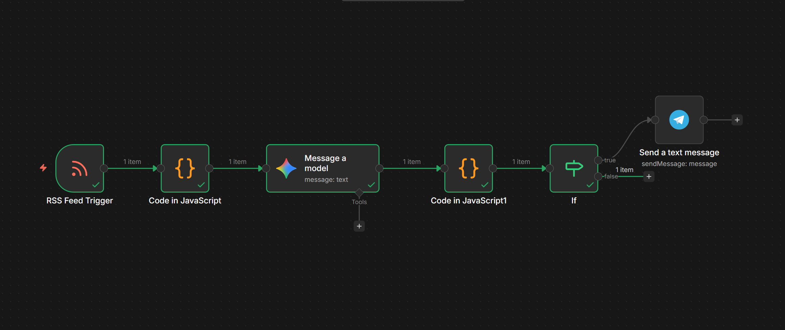

# Ukraine-Russia-GoldNews
Eine Automatisierung die mir Breaking News des Ukraine Kriegs per push Nachricht senden kann, sofern Gemini diese als wichtig genug einstuft, da ich Interesse daran hab zu sehen wie schnell der Markt reagiert und ob vielleicht  durch private langsame und  ängstliche Markteilnehmer eine kleines Verkaufs/Kaufs Fenster besteht, was noch nicht von großen Akteuren voll genutzt wird.

 English full: 
 # Gold Sentiment Analyzer (n8n Workflow)

A serverless automation workflow that monitors financial RSS feeds for geopolitical events and analyzes their potential impact on gold prices .

## Overview
I built this tool to automate the monitoring of breaking news. Instead of checking feeds manually, this workflow filters news for specific keywords (e.g., NATO, Escalation) and uses an LLM to determine if the news is "bullish" for gold. If the urgency score is high enough, I get a ping on Telegram.

## How it works
The workflow runs on **n8n** and follows this logic:

1.  **Ingestion:** Polls Yahoo Finance RSS feeds every 5 minutes.
2.  **Pre-Filtering (JavaScript):** Before calling any API, a custom Code Node filters out irrelevant articles based on keywords to save costs and processing time.
3.  **Analysis (Gemini 1.5 Flash):** Relevant articles are sent to Google's Gemini model. I used a custom system prompt to force a structured JSON output containing sentiment, urgency (1-10), and a short reason.
4.  **Error Handling & Parsing:** A JS function cleans the raw string response from the LLM (handling potential Markdown formatting issues) and parses it into a JSON object.
5.  **Routing:** A logic switch only triggers the alert if `Urgency > 7` OR `Sentiment == Bullish`.
6.  **Alerting:** Sends a formatted message to a private Telegram chat via the Bot API.

## Tech Stack
* **n8n** (Self-hosted/Cloud)
* **JavaScript** (ES6 for data transformation)
* **Google Gemini API** (LLM)
* **Telegram Bot API**

## Setup
1.  Import `workflow.json` into n8n.
2.  Add your Google Gemini API Key in the credentials section.
3.  Create a Telegram Bot via @BotFather and add the Token.
4.  Adjust the `keywords` array in the first Code Node if you want to track other assets.
